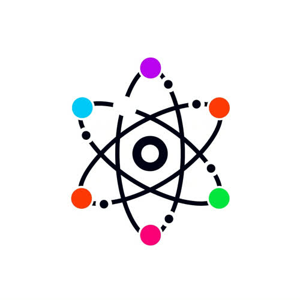

<!-- Top Logo -->

<p align="center">
  
</p>

<!-- Stats Badges -->

<p align="center">
  
  
  
</p>

# Nytrogen Compiler

**Nytrogen** is a powerful, statically-typed, compiled programming language designed for performance and reliability. This repository contains the official Nytrogen compiler, which translates Nytrogen source code into highly optimized machine code.

This project is intended for developers who need a language that is both expressive and close to the metal. Nytrogen is suitable for a wide range of applications, from systems programming to high-performance computing.

## About Nytrogen

* **Purpose:** A general-purpose programming language focused on performance and control.
* **Language:** A modern, C-style procedural language with advanced features.
* **Status:** Under active development.

## Features

The Nytrogen language supports a variety of essential and advanced programming features:

* **Data Types:** `int`, `string`, `bool`, `char`, pointers (`*`), arrays (`[]`), and user-defined `structs`.
* **Control Flow:** `if-else` statements, `for` loops, and `while` loops for fine-grained control over program execution.
* **Functions:** First-class functions with support for parameters, return values, and recursion.
* **Structs:** Create custom data structures with member fields and methods.
* **Memory Management:** Manual memory management with pointers, giving you full control over memory allocation and deallocation.
* **Inline Assembly:** Seamlessly embed assembly code within your Nytrogen source for low-level optimizations.
* **Modules and Imports:** Organize your code into modules and import them as needed.
* **Extern:** Makes for very good C (possibly C++) compatibility.

For a complete list of features and syntax, please refer to the [Language Grammar](./docs/grammer.md) document.

## Getting Started

```bash
# Build the compiler
./bootstrap/build.sh

# Run a Nytrogen source file
./run.sh <your_file.nyt>
```

For more detailed instructions, please see the **[Getting Started Guide](./docs/getting_started.md)**.

## Documentation

* **[Getting Started](./docs/getting_started.md)**
* **[Language Grammar](./docs/grammer.md)**
* **[Compiler Architecture](./docs/architecture.md)**

## Project Structure

* `bootstrap/`: The bootstrap compiler written in C++.
* `compiler/`: The self-hosted Nytrogen compiler written in Nytrogen.
* `docs/`: Project documentation.
* `tests/`: Sample Nytrogen programs for testing.
* `run.sh`: A script to compile and run Nytrogen programs.

## Contributing

Contributions are highly encouraged! If you would like to contribute, please feel free to open an issue or submit a pull request.

## License

This project is licensed under the MIT License. See the [LICENSE](./LICENSE) file for details.
