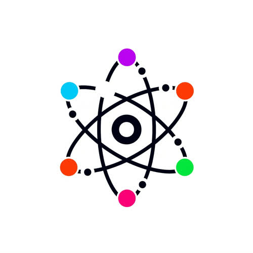

<!-- Top Logo -->

<p align="center">
  
</p>

<!-- Stats Badges -->

<p align="center">
  
  
  
  
  
</p>

# Nytrogen Programming Language & Toolchain

**Nytrogen** is a powerful, statically-typed, compiled systems programming language designed for performance, control, and reliability. Beyond standard general-purpose computing, Nytrogen features **native first-class quantum computing integration** (`qlib`), letting you simulate qubits, apply matrices, and handle quantum states right out of the box.

---

## ⚛️ What Makes Nytrogen Different?

While Nytrogen is built as a fast, close-to-the-metal general-purpose compiler (translating directly to optimized x86-64 assembly via NASM), it stands out by blending systems programming with **quantum simulation primitives**:

    int main() {
        // Define a qubit natively with custom complex amplitudes
        qubit q(a: 1, b: 0);
        // Or without the amplitudes: "qubit q;" and it will be [1, 0] automatically
    
        // Apply quantum operations natively using arrow syntax
        h -> q; 
        
        print q; // Inspect qubit state
        return 0;
    }

---

## 🚀 Key Features

- **Blazing Fast Native Compilation:** Complete modular toolchain (`nytro` driver -> `nytro-pre` preprocessor -> `nytro-c` compiler core) emitting raw x86-64 machine code with register allocation and stack spilling.
- **Quantum-Ready (`qlib`):** Built-in primitives for `qubit`, `matrix`, and `complex` numbers to execute quantum algorithms natively.
- **Modern Syntax Sugar:** Trailing return types (`auto add(int a, int b) -> int`), auto-type deduction, and type-safe string formatting (`format("x = {}" : x)`).
- **C/C++ Interoperability:** Seamless Foreign Function Interface (FFI) using `extern` declarations to pull in standard binaries like `malloc`.
- **Modular Scoping:** Full support for `namespace` blocks and custom `struct` definitions.

For a complete breakdown of language syntax, check out the **[Language Grammar & Spec](./docs/grammar.md)**.

---

## Getting Started

### Installation on Arch Linux (AUR)

```bash
yay -S nytrogen-git
```

### Building from Source

```bash
# Build the toolchain
./run.sh -cbuild

# Run a Nytrogen source file
./run.sh test.ny
```

For more detailed setup steps, check out the **[Getting Started Guide](./docs/getting_started.md)**.

---

## 📚 Documentation

- **[Getting Started Guide](./docs/getting_started.md)**
- **[Language Grammar & Spec](./docs/grammar.md)**
- **[Compiler Architecture & Pipeline](./docs/architecture.md)**

---

## 🗂️ Project Structure

- `compiler/`: The core compiler (`nytro-c`) written in C++ (Lexer, Parser, Semantic Analyzer, Code Generator).
- `Preprocessor/`: The preprocessor (`nytro-pre`) handling macro expansions and `#include` headers.
- `driver/`: The compiler driver (`nytro`) coordinating the entire build pipeline.
- `runtime/`: The standard library runtime (`libstdny`) and core headers (`io.nyt`, `math.nyt`, etc.).
- `docs/`: In-depth project documentation and architecture breakdowns.
- `tests/`: Comprehensive test suite for types, math, control flow, and quantum simulations.
- `run.sh`: Helper script to compile and execute Nytrogen programs.

---

## 🤝 Contributing

Contributions are heavily encouraged! If you want to expand the compiler, optimize the backend register allocator, or improve `qlib`, feel free to open an issue or submit a pull request.

---

## 📄 License

This project is licensed under the GNU GPL v3.0 License. See the [LICENSE](./LICENSE) file for details.
