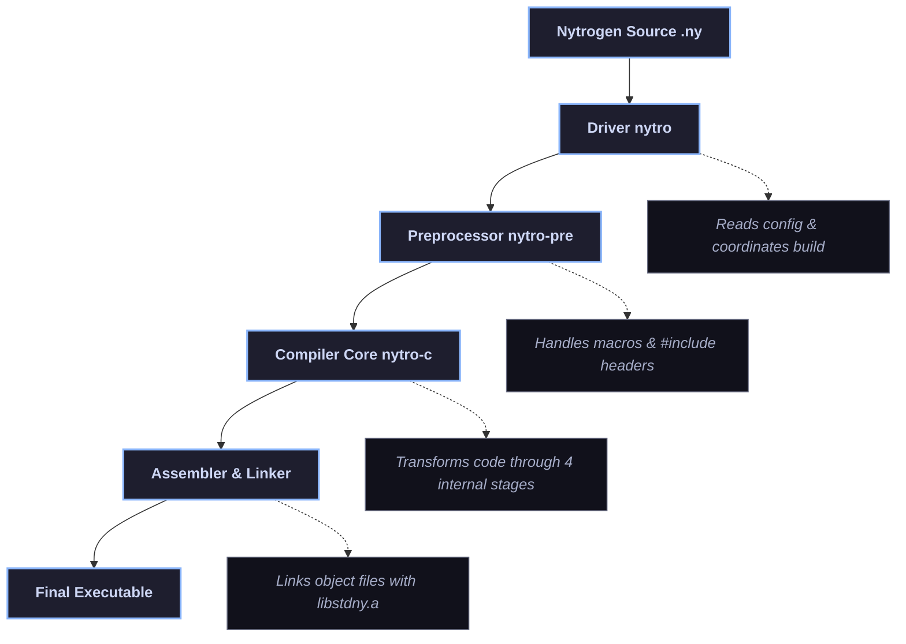

# Nytrogen Compiler Architecture

This document provides a high-level overview of Nytrogen's complete toolchain pipeline and internal architecture. 
The Nytrogen compiler is not just a single binary; it is a modular toolchain consisting of a configuration driver, a preprocessor, a semantic compiler core, a standard library runtime (`libstdny`), and quantum simulation extensions (`qlib`). 

## Full Toolchain Pipeline

---

## 1. The Driver (`nytro` / `driver/`)

- **Source Files:** `driver/src/driver.cpp`, `driver/src/config_loader.cpp`
  - **Responsibility:** Acts as the primary entry point interface for users. It parses flags (`-verbose`, `-debug`, `-entry`), processes project settings, and orchestrates the preprocessor, compiler core, NASM assembler, and system linker (`ld`) sequentially. 
    
    ## 2. The Preprocessor (`nytro-pre` / `Preprocessor/`)
  - **Source Files:** `Preprocessor/src/main.cpp`, `Preprocessor/src/file_handler.cpp`, `Preprocessor/src/macro_handler.cpp`
  - **Responsibility:** Runs prior to compilation syntax checks. It recursively resolves header inclusions (e.g., `#include <io.nyt>`) from the `runtime/headers/` directory and handles custom macro replacements, outputting a consolidated preprocessed source (`.pre.nyt`). 
    
    ## 3. The Compiler Core (`nytro-c` / `compiler/`)
    
    Once preprocessed, the clean source code enters the core compiler pipeline: 
    
    ### A. Lexical Analysis (Lexer)
  - **Source Files:** `compiler/src/lexer.cpp`, `compiler/include/lexer.hpp`
  - **Responsibility:** Converts the character stream into discrete tokens (keywords, literals, identifiers, and symbols). 
    
    ### B. Syntax Analysis (Parser)
  - **Source Files:** `compiler/src/parser.cpp`, `compiler/include/parser.hpp`
  - **Responsibility:** Validates grammar rules and constructs the hierarchical **Abstract Syntax Tree (AST)**. 
    
    ### C. Semantic Analysis
  - **Source Files:** `compiler/src/semantic_analyzer.cpp`, `compiler/include/semantic_analyzer.hpp`
  - **Responsibility:** Enforces type safety, manages symbol scopes, checks function argument lengths, resolves namespaces, and annotates the AST. 
    
    ### D. Code Generation & Register Allocation
  - **Source Files:** `compiler/src/code_generator.cpp`, `compiler/src/register_allocator.cpp`, `compiler/src/instruction_set/`
  - **Responsibility:** Translates the validated AST into x86-64 assembly. It utilizes a custom register allocator with stack-spilling mechanics, handling scalar XMM instructions for floats/doubles, vector instructions for complex numbers, and low-level stack layout frames. 
  
  --- 
  
  ## 4. Runtime & Standard Library (`runtime/libstdny/`)
  
  - **Source Files:** `runtime/libstdny/core/`, `runtime/libstdny/qlib/`
  - **Responsibility:** Built as a static archive (`libstdny.a`), providing core system integrations, formatting (`ny_format`), input/output routines, and quantum simulation backends (`qlib`) that handle state amplitudes and gate matrices (`q_apply_matrix`). 
  
  --- 
  
  ## Name Mangling Specification
  
  To support namespaces, function overloading, and safe linkage, Nytrogen uses a standardized mangling schema:
  
  - **Variables:** `_N <namespace_length> <namespace_name> <var_length> <var_name>` 
    
    ## Conclusion
    
    This separation of concerns—splitting configuration control, text preprocessing, AST compilation, and standard runtime execution—makes the Nytrogen toolchain clean, extensible, and maintainable.
